# Doc Studio — Diagrams catalog

Every diagram used across the design docs, collected in one place plus
diagrams that don't fit any single doc. Copy into presentations or
export via GitHub's mermaid renderer.

**Index**

1. [System context](#1-system-context)
2. [Component tree (React)](#2-component-tree-react)
3. [Architectural layers](#3-architectural-layers)
4. [Data model (class diagram)](#4-data-model-class-diagram)
5. [State machines](#5-state-machines)
6. [Sequence diagrams — hydration & persistence](#6-sequence-diagrams--hydration--persistence)
7. [Sequence diagrams — editing & preview](#7-sequence-diagrams--editing--preview)
8. [Sequence diagrams — imports](#8-sequence-diagrams--imports)
9. [Sequence diagrams — API workbench](#9-sequence-diagrams--api-workbench)
10. [Sequence diagrams — export](#10-sequence-diagrams--export)
11. [Sequence diagrams — archives & collections](#11-sequence-diagrams--archives--collections)
12. [Sequence diagrams — LaTeX](#12-sequence-diagrams--latex)
13. [Sequence diagrams — Mermaid](#13-sequence-diagrams--mermaid)
14. [Data-flow diagrams](#14-data-flow-diagrams)
15. [Store action → reducer map](#15-store-action--reducer-map)
16. [Deployment topologies](#16-deployment-topologies)
17. [Build pipeline](#17-build-pipeline)
18. [Native shell process models](#18-native-shell-process-models)
19. [Storage schema (ER-style)](#19-storage-schema-er-style)
20. [Timeline diagrams (Gantt)](#20-timeline-diagrams-gantt)
21. [Journey diagrams](#21-journey-diagrams)
22. [Threat model attack tree](#22-threat-model-attack-tree)
23. [File-drop routing decision tree](#23-file-drop-routing-decision-tree)
24. [Preview mode selection tree](#24-preview-mode-selection-tree)

---

## 1. System context

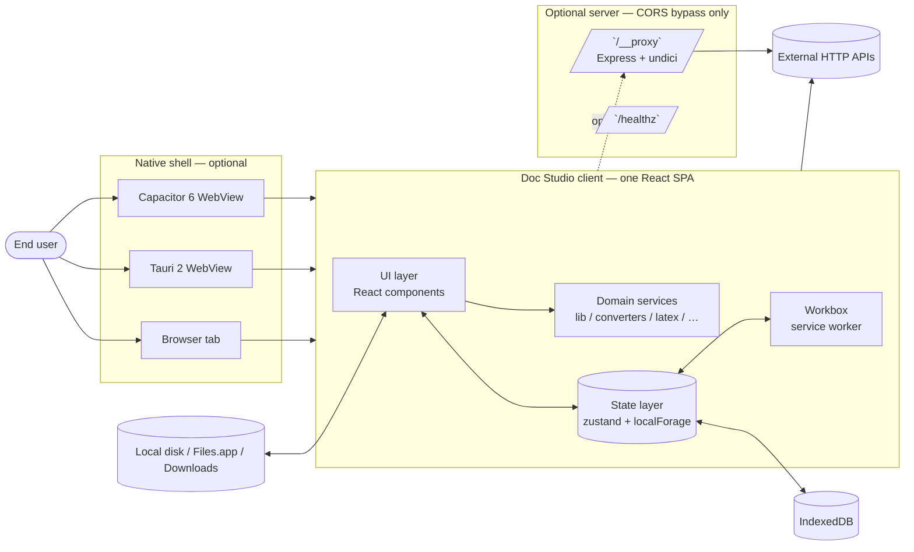
```mermaid
flowchart LR
  User([End user])

  subgraph Shell[Native shell — optional]
    Tauri[Tauri 2 WebView]
    Cap[Capacitor 6 WebView]
    Browser[Browser tab]
  end

  subgraph Client[Doc Studio client — one React SPA]
    UI[UI layer<br/>React components]
    Store[(State layer<br/>zustand + localForage)]
    Services[Domain services<br/>lib / converters / latex / …]
    SW[Workbox<br/>service worker]
  end

  subgraph OptionalServer[Optional server — CORS bypass only]
    Proxy[/`/__proxy`<br/>Express + undici/]
    Health[/`/healthz`/]
  end

  Ext[(External HTTP APIs)]
  Disk[(Local disk / Files.app / Downloads)]
  IDB[(IndexedDB)]

  User --> Browser --> Client
  User --> Tauri --> Client
  User --> Cap --> Client

  UI <--> Store
  UI --> Services
  Store <--> IDB
  Store <--> SW

  Disk <--> UI

  Client -. optional .-> Proxy
  Client --> Ext
  Proxy --> Ext
```

---

## 2. Component tree (React)

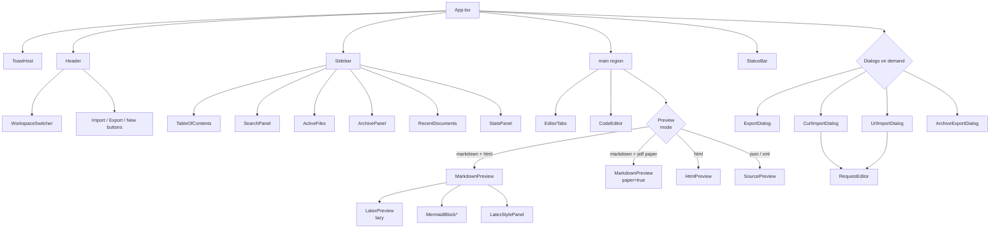
```mermaid
flowchart TD
  App["App.tsx"]
  App --> Toast["ToastHost"]
  App --> Header["Header"]
  App --> Sidebar["Sidebar"]
  App --> Main["main region"]
  App --> Status["StatusBar"]

  Header --> WS["WorkspaceSwitcher"]
  Header --> Buttons["Import / Export / New buttons"]

  Sidebar --> Toc["TableOfContents"]
  Sidebar --> Search["SearchPanel"]
  Sidebar --> Files["ActiveFiles"]
  Sidebar --> Archives["ArchivePanel"]
  Sidebar --> Recents["RecentDocuments"]
  Sidebar --> Stats["StatsPanel"]

  Main --> Tabs["EditorTabs"]
  Main --> Editor["CodeEditor"]
  Main --> Preview{Preview<br/>mode}

  Preview -->|markdown + html| MP["MarkdownPreview"]
  Preview -->|markdown + pdf paper| MP2["MarkdownPreview<br/>paper=true"]
  Preview -->|html| HP["HtmlPreview"]
  Preview -->|json / xml| SP["SourcePreview"]

  MP --> LP["LatexPreview<br/>lazy"]
  MP --> MB["MermaidBlock*"]
  MP --> LSP["LatexStylePanel"]

  App --> Dialogs{Dialogs on demand}
  Dialogs --> ED["ExportDialog"]
  Dialogs --> CID["CurlImportDialog"]
  Dialogs --> UID["UrlImportDialog"]
  Dialogs --> AED["ArchiveExportDialog"]

  CID --> RE["RequestEditor"]
  UID --> RE
```

---

## 3. Architectural layers

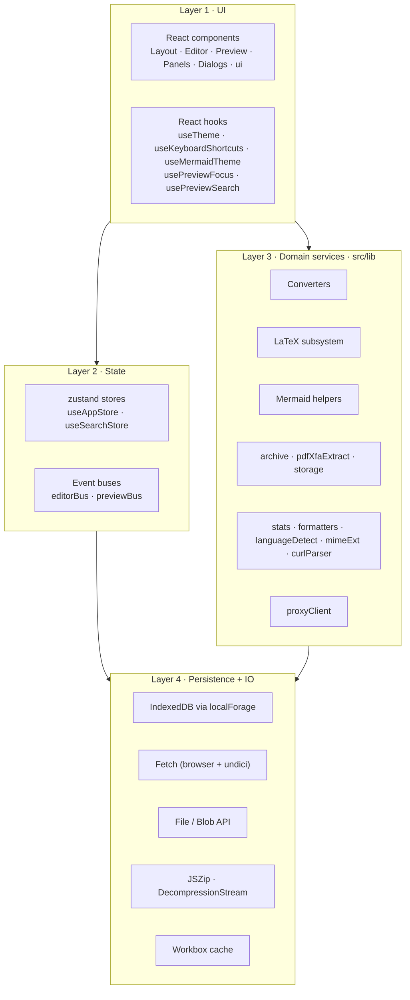
```mermaid
flowchart TB
  subgraph L1[Layer 1 · UI]
    L1a["React components<br/>Layout · Editor · Preview · Panels · Dialogs · ui"]
    L1b["React hooks<br/>useTheme · useKeyboardShortcuts · useMermaidTheme<br/>usePreviewFocus · usePreviewSearch"]
  end
  subgraph L2[Layer 2 · State]
    L2a["zustand stores<br/>useAppStore · useSearchStore"]
    L2b["Event buses<br/>editorBus · previewBus"]
  end
  subgraph L3[Layer 3 · Domain services · src/lib]
    L3a["Converters"]
    L3b["LaTeX subsystem"]
    L3c["Mermaid helpers"]
    L3d["archive · pdfXfaExtract · storage"]
    L3e["stats · formatters · languageDetect · mimeExt · curlParser"]
    L3f["proxyClient"]
  end
  subgraph L4[Layer 4 · Persistence + IO]
    L4a["IndexedDB via localForage"]
    L4b["Fetch (browser + undici)"]
    L4c["File / Blob API"]
    L4d["JSZip · DecompressionStream"]
    L4e["Workbox cache"]
  end

  L1 --> L2
  L1 --> L3
  L2 --> L4
  L3 --> L4
```

---

## 4. Data model (class diagram)

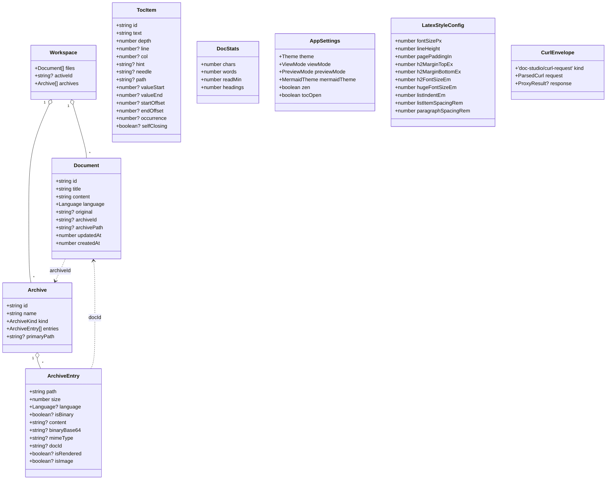
```mermaid
classDiagram
  class Document {
    +string id
    +string title
    +string content
    +Language language
    +string? original
    +string? archiveId
    +string? archivePath
    +number updatedAt
    +number createdAt
  }
  class Workspace {
    +Document[] files
    +string? activeId
    +Archive[] archives
  }
  class Archive {
    +string id
    +string name
    +ArchiveKind kind
    +ArchiveEntry[] entries
    +string? primaryPath
  }
  class ArchiveEntry {
    +string path
    +number size
    +Language? language
    +boolean? isBinary
    +string? content
    +string? binaryBase64
    +string? mimeType
    +string? docId
    +boolean? isRendered
    +boolean? isImage
  }
  class TocItem {
    +string id
    +string text
    +number depth
    +number? line
    +number? col
    +string? hint
    +string? needle
    +string? path
    +number? valueStart
    +number? valueEnd
    +number? startOffset
    +number? endOffset
    +number? occurrence
    +boolean? selfClosing
  }
  class DocStats {
    +number chars
    +number words
    +number readMin
    +number headings
  }
  class AppSettings {
    +Theme theme
    +ViewMode viewMode
    +PreviewMode previewMode
    +MermaidTheme mermaidTheme
    +boolean zen
    +boolean tocOpen
  }
  class LatexStyleConfig {
    +number fontSizePx
    +number lineHeight
    +number pagePaddingIn
    +number h2MarginTopEx
    +number h2MarginBottomEx
    +number h2FontSizeEm
    +number hugeFontSizeEm
    +number listIndentEm
    +number listItemSpacingRem
    +number paragraphSpacingRem
  }
  class CurlEnvelope {
    +'doc-studio/curl-request' kind
    +ParsedCurl request
    +ProxyResult? response
  }
  Workspace "1" o-- "*" Document
  Workspace "1" o-- "*" Archive
  Archive "1" o-- "*" ArchiveEntry
  Document ..> Archive : archiveId
  ArchiveEntry ..> Document : docId
```

---

## 5. State machines

### 5.1 Document lifecycle

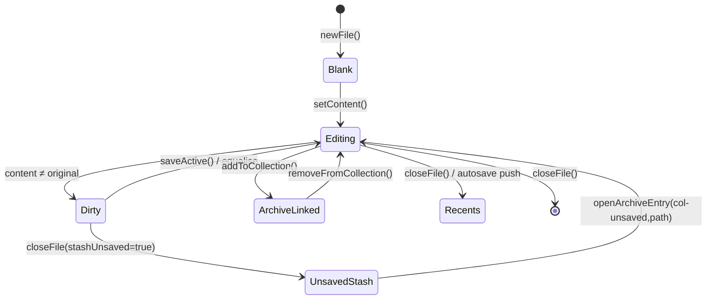
```mermaid
stateDiagram-v2
  [*] --> Blank : newFile()
  Blank --> Editing : setContent()
  Editing --> Dirty : content ≠ original
  Dirty --> Editing : saveActive() / equalise
  Editing --> ArchiveLinked : addToCollection()
  ArchiveLinked --> Editing : removeFromCollection()
  Editing --> Recents : closeFile() / autosave push
  Dirty --> UnsavedStash : closeFile(stashUnsaved=true)
  Editing --> [*] : closeFile()
  UnsavedStash --> Editing : openArchiveEntry(col-unsaved,path)
```

### 5.2 Preview mode

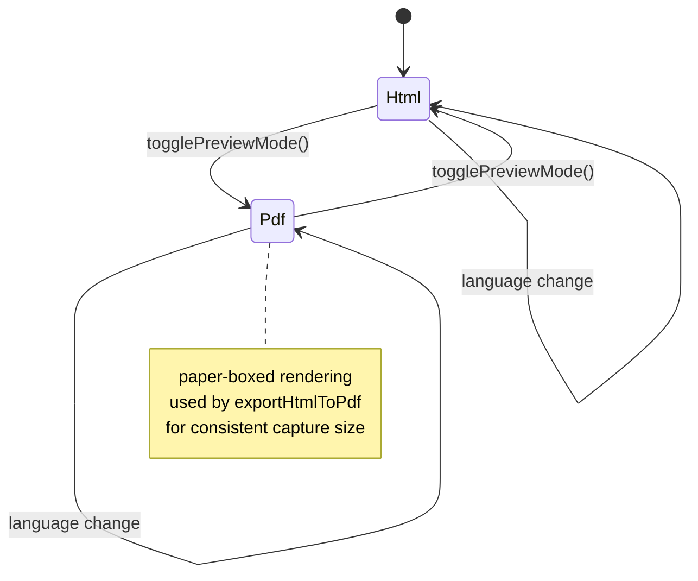
```mermaid
stateDiagram-v2
  [*] --> Html
  Html --> Pdf : togglePreviewMode()
  Pdf --> Html : togglePreviewMode()
  Html --> Html : language change
  Pdf --> Pdf : language change
  note right of Pdf
    paper-boxed rendering
    used by exportHtmlToPdf
    for consistent capture size
  end note
```

### 5.3 View mode

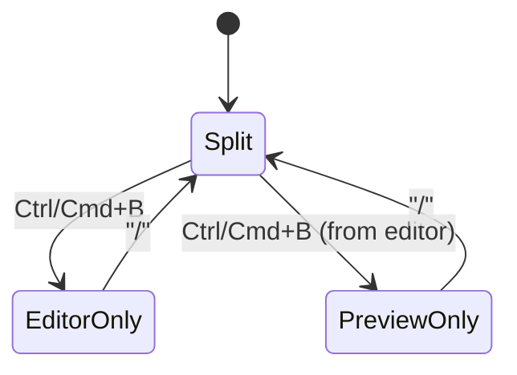
```mermaid
stateDiagram-v2
  [*] --> Split
  Split --> EditorOnly : Ctrl/Cmd+B
  Split --> PreviewOnly : Ctrl/Cmd+B (from editor)
  EditorOnly --> Split : "/"
  PreviewOnly --> Split : "/"
```

### 5.4 Theme

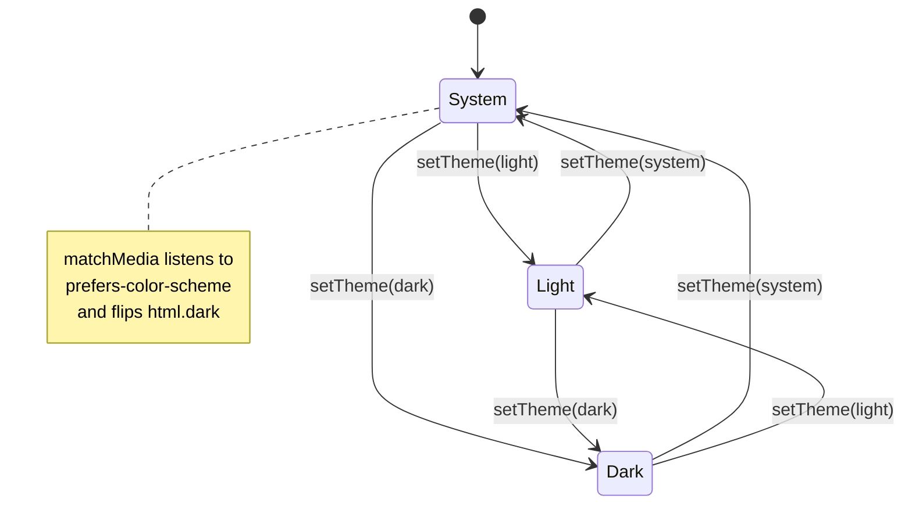
```mermaid
stateDiagram-v2
  [*] --> System
  System --> Light : setTheme(light)
  System --> Dark : setTheme(dark)
  Light --> System : setTheme(system)
  Dark --> System : setTheme(system)
  Light --> Dark : setTheme(dark)
  Dark --> Light : setTheme(light)
  note right of System
    matchMedia listens to
    prefers-color-scheme
    and flips html.dark
  end note
```

### 5.5 Autosave debouncer

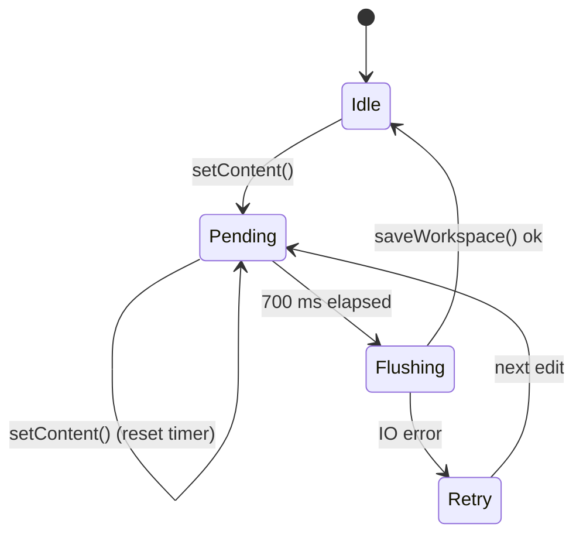
```mermaid
stateDiagram-v2
  [*] --> Idle
  Idle --> Pending : setContent()
  Pending --> Pending : setContent() (reset timer)
  Pending --> Flushing : 700 ms elapsed
  Flushing --> Idle : saveWorkspace() ok
  Flushing --> Retry : IO error
  Retry --> Pending : next edit
```

### 5.6 Undo / redo

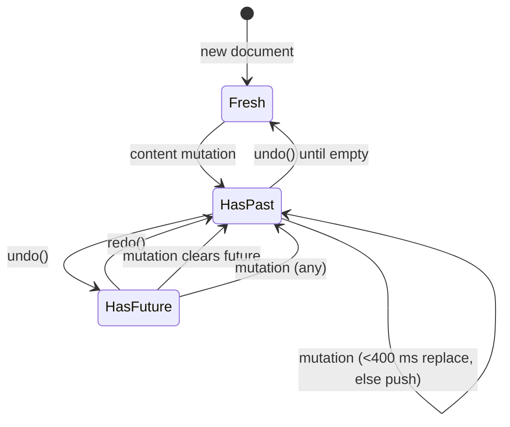
```mermaid
stateDiagram-v2
  [*] --> Fresh : new document
  Fresh --> HasPast : content mutation
  HasPast --> HasPast : mutation (<400 ms replace, else push)
  HasPast --> Fresh : undo() until empty
  HasPast --> HasFuture : undo()
  HasFuture --> HasPast : redo()
  HasFuture --> HasPast : mutation clears future
  HasFuture --> HasPast : mutation (any)
```

### 5.7 Proxy availability

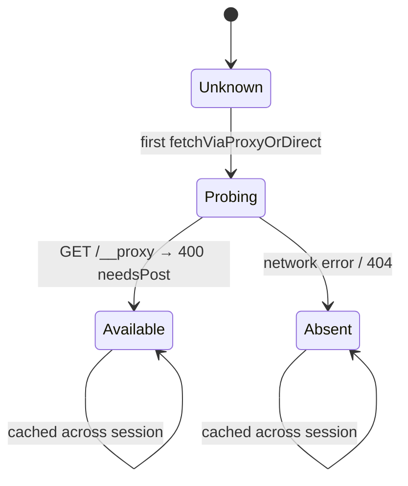
```mermaid
stateDiagram-v2
  [*] --> Unknown
  Unknown --> Probing : first fetchViaProxyOrDirect
  Probing --> Available : GET /__proxy → 400 needsPost
  Probing --> Absent : network error / 404
  Available --> Available : cached across session
  Absent --> Absent : cached across session
```

### 5.8 Workspace resolution

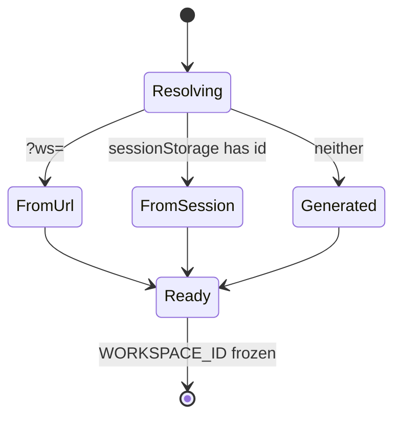
```mermaid
stateDiagram-v2
  [*] --> Resolving
  Resolving --> FromUrl : ?ws=<valid>
  Resolving --> FromSession : sessionStorage has id
  Resolving --> Generated : neither
  FromUrl --> Ready
  FromSession --> Ready
  Generated --> Ready
  Ready --> [*] : WORKSPACE_ID frozen
```

---

## 6. Sequence diagrams — hydration & persistence

### 6.1 Cold-start hydration

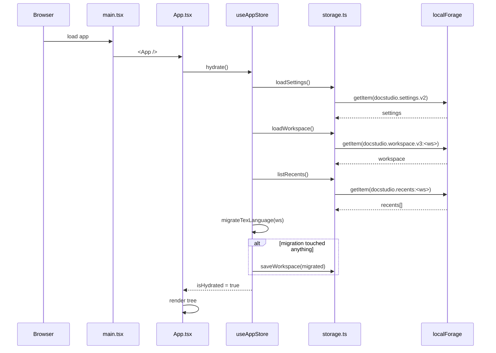
```mermaid
sequenceDiagram
  participant Browser
  participant Main as main.tsx
  participant App as App.tsx
  participant Store as useAppStore
  participant Storage as storage.ts
  participant IDB as localForage
  Browser->>Main: load app
  Main->>App: <App />
  App->>Store: hydrate()
  Store->>Storage: loadSettings()
  Storage->>IDB: getItem(docstudio.settings.v2)
  IDB-->>Storage: settings
  Store->>Storage: loadWorkspace()
  Storage->>IDB: getItem(docstudio.workspace.v3:<ws>)
  IDB-->>Storage: workspace
  Store->>Storage: listRecents()
  Storage->>IDB: getItem(docstudio.recents:<ws>)
  IDB-->>Storage: recents[]
  Store->>Store: migrateTexLanguage(ws)
  alt migration touched anything
    Store->>Storage: saveWorkspace(migrated)
  end
  Store-->>App: isHydrated = true
  App->>App: render tree
```

### 6.2 Autosave coalescing

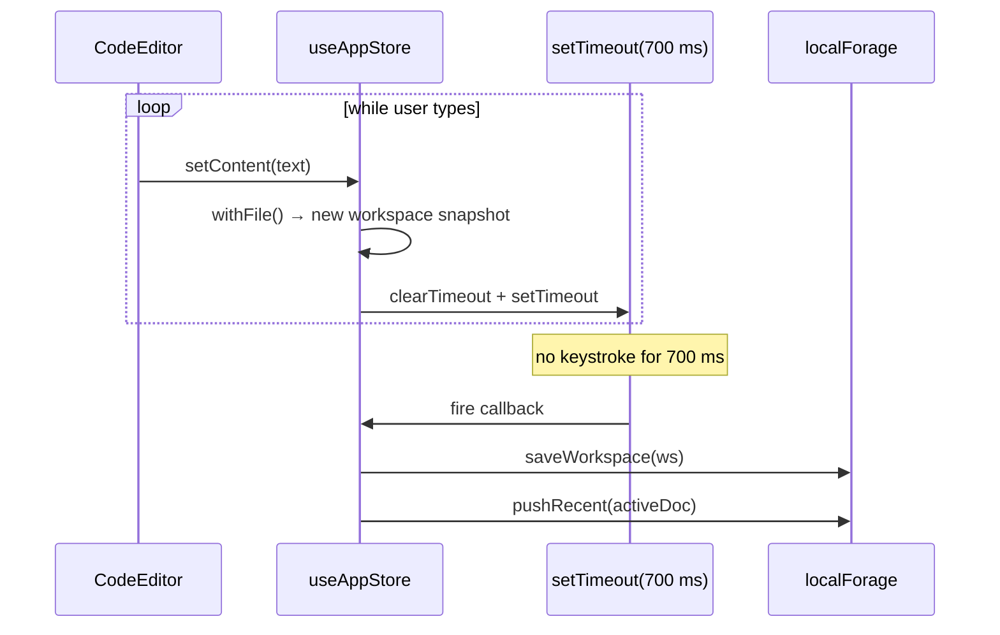
```mermaid
sequenceDiagram
  participant Editor as CodeEditor
  participant Store as useAppStore
  participant Timer as setTimeout(700 ms)
  participant IDB as localForage
  loop while user types
    Editor->>Store: setContent(text)
    Store->>Store: withFile() → new workspace snapshot
    Store->>Timer: clearTimeout + setTimeout
  end
  Note over Timer: no keystroke for 700 ms
  Timer->>Store: fire callback
  Store->>IDB: saveWorkspace(ws)
  Store->>IDB: pushRecent(activeDoc)
```

### 6.3 Settings write-through

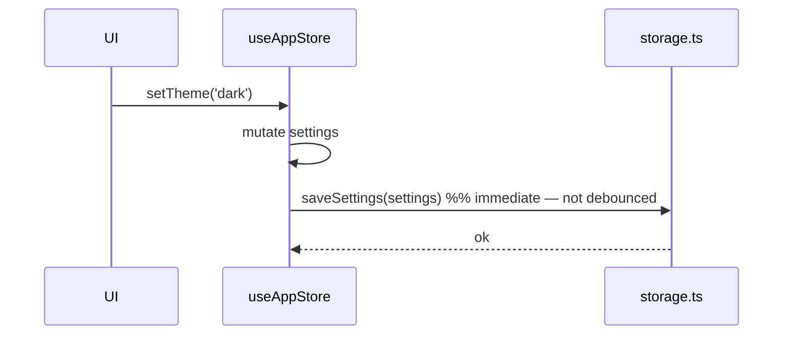
```mermaid
sequenceDiagram
  participant UI
  participant Store as useAppStore
  participant Storage as storage.ts
  UI->>Store: setTheme('dark')
  Store->>Store: mutate settings
  Store->>Storage: saveSettings(settings)  %% immediate — not debounced
  Storage-->>Store: ok
```

### 6.4 Recents LRU push

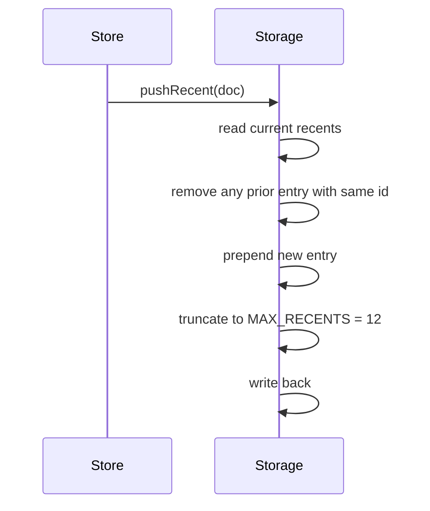
```mermaid
sequenceDiagram
  participant Store
  participant Storage
  Store->>Storage: pushRecent(doc)
  Storage->>Storage: read current recents
  Storage->>Storage: remove any prior entry with same id
  Storage->>Storage: prepend new entry
  Storage->>Storage: truncate to MAX_RECENTS = 12
  Storage->>Storage: write back
```

---

## 7. Sequence diagrams — editing & preview

### 7.1 Keystroke → debounced preview

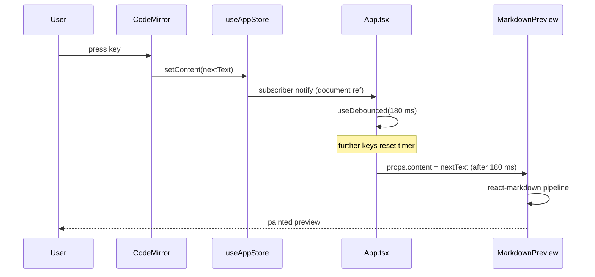
```mermaid
sequenceDiagram
  participant User
  participant CM as CodeMirror
  participant Store as useAppStore
  participant App as App.tsx
  participant Prev as MarkdownPreview
  User->>CM: press key
  CM->>Store: setContent(nextText)
  Store->>App: subscriber notify (document ref)
  App->>App: useDebounced(180 ms)
  Note over App: further keys reset timer
  App->>Prev: props.content = nextText (after 180 ms)
  Prev->>Prev: react-markdown pipeline
  Prev-->>User: painted preview
```

### 7.2 Language switch (JSON → XML)

```mermaid
sequenceDiagram
  participant User
  participant Tabs as EditorTabs
  participant Store
  participant CM as CodeEditor
  participant Comp as Compartment
  User->>Tabs: right-click → convert to XML
  Tabs->>Store: setLanguage('xml')
  Store-->>CM: language prop updates
  CM->>Comp: reconfigure with langExtension('xml')
  Note over CM: view is preserved; only extension swaps
```

### 7.3 Cursor jump from TOC

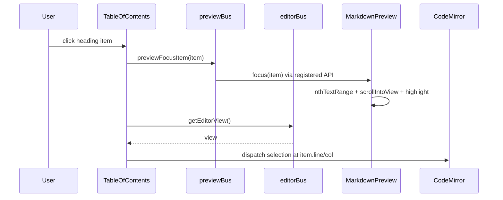
```mermaid
sequenceDiagram
  participant User
  participant TOC as TableOfContents
  participant PB as previewBus
  participant EB as editorBus
  participant Prev as MarkdownPreview
  participant CM as CodeMirror
  User->>TOC: click heading item
  TOC->>PB: previewFocusItem(item)
  PB->>Prev: focus(item) via registered API
  Prev->>Prev: nthTextRange + scrollIntoView + highlight
  TOC->>EB: getEditorView()
  EB-->>TOC: view
  TOC->>CM: dispatch selection at item.line/col
```

### 7.4 Preview search highlight

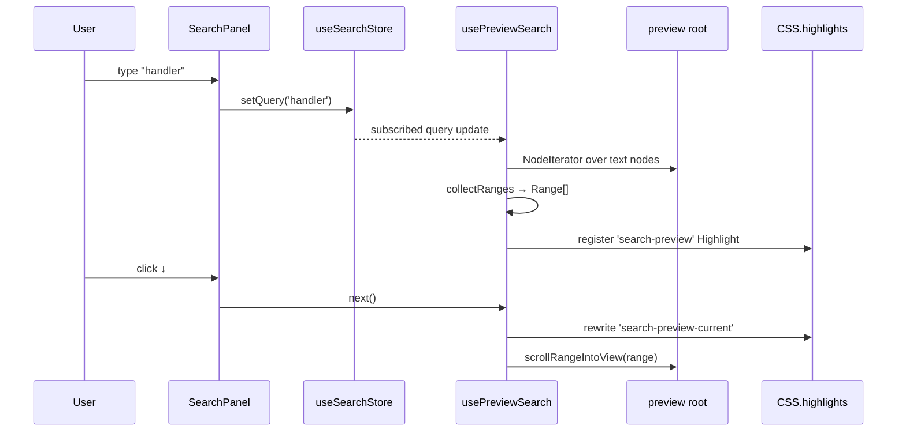
```mermaid
sequenceDiagram
  participant User
  participant SP as SearchPanel
  participant SS as useSearchStore
  participant Hook as usePreviewSearch
  participant Prev as preview root
  participant Hi as CSS.highlights
  User->>SP: type "handler"
  SP->>SS: setQuery('handler')
  SS-->>Hook: subscribed query update
  Hook->>Prev: NodeIterator over text nodes
  Hook->>Hook: collectRanges → Range[]
  Hook->>Hi: register 'search-preview' Highlight
  User->>SP: click ↓
  SP->>Hook: next()
  Hook->>Hi: rewrite 'search-preview-current'
  Hook->>Prev: scrollRangeIntoView(range)
```

### 7.5 CodeMirror registration

```mermaid
sequenceDiagram
  participant CE as CodeEditor
  participant EB as editorBus
  participant Panel as Sidebar panel
  CE->>CE: mount view (EditorView)
  CE->>EB: setEditorView(view)
  EB-->>Panel: subscribeEditorView callback
  Panel-->>Panel: enable "jump to line" buttons
  CE->>CE: unmount
  CE->>EB: setEditorView(null)
  EB-->>Panel: null received
  Panel-->>Panel: disable jump buttons
```

---

## 8. Sequence diagrams — imports

### 8.1 File drop routing (App.tsx)

```mermaid
sequenceDiagram
  participant User
  participant CE as CodeEditor
  participant App as App.tsx
  participant Arch as archive.ts
  participant XFA as pdfXfaExtract
  participant Conv as converters
  User->>CE: dropFiles
  CE->>App: onDropFiles(files)
  loop for each file
    App->>Arch: detectArchiveKind(name/mime)
    alt is container
      App->>Arch: unpackArchive(file)
      Arch-->>App: Archive
      App->>Store: openArchive(archive)
    else pdf
      App->>XFA: extractXfaXml(bytes)
      alt has XFA
        App->>Store: openDoc({content:xml, language:'xml'})
      else no XFA
        App->>Store: openDoc({content:'(no XFA)', language:'markdown'})
      end
    else html/htm
      App->>Conv: htmlToMarkdown(text)
      App->>Store: openDoc(md)
    else docx/xlsx/pptx (also handled via detectArchiveKind)
      Note over App: same as container branch
    else other
      App->>Store: openDoc({content:text, language:detected})
    end
  end
```

### 8.2 DOCX unpack + render preview

```mermaid
sequenceDiagram
  participant User
  participant Arch as archive.ts
  participant Zip as JSZip
  participant Mam as docxToMd.loadMammoth
  participant Turn as htmlToMd
  participant Store
  User->>Arch: unpackArchive(docxFile)
  Arch->>Zip: loadAsync(arrayBuffer)
  Zip-->>Arch: entries
  loop every entry
    Arch->>Arch: classify (text/image/binary/oversized)
    Arch->>Arch: yieldToBrowser() every 32
  end
  Arch->>Arch: renderPreviewFor(archive)
  Arch->>Mam: docxToMarkdown(file)
  Mam->>Mam: inject <script src="mammoth.browser.min.js">
  Mam->>Mam: mammoth.convertToHtml
  Mam->>Turn: htmlToMarkdown(html)
  Turn-->>Arch: markdown
  Arch->>Arch: prepend '(rendered preview).md' entry
  Arch-->>Store: Archive
```

### 8.3 XFA extraction two-pass

```mermaid
sequenceDiagram
  participant Caller
  participant XFA as extractXfaXml
  participant Dec as DecompressionStream
  Caller->>XFA: extractXfaXml(bytes)
  XFA->>XFA: latin1 scan for <xdp:xdp
  alt match found
    XFA-->>Caller: {xml, source:'raw', offset}
  else no match — walk streams
    loop each stream ... endstream
      XFA->>XFA: parse preceding dict
      alt has /Filter /FlateDecode
        XFA->>Dec: inflate stream bytes
        Dec-->>XFA: decoded
        XFA->>XFA: scan decoded for <xdp:xdp
        alt hit
          XFA-->>Caller: {xml, source:'flate-stream', offset:-1}
        end
      end
    end
    XFA-->>Caller: null
  end
```

### 8.4 URL import

```mermaid
sequenceDiagram
  participant User
  participant D as UrlImportDialog
  participant PC as proxyClient
  participant Mime as mimeExt
  participant Arch as archive.ts
  participant Store
  User->>D: paste URL + headers
  D->>PC: fetchViaProxyOrDirect(url, {headers, method:'GET'})
  PC-->>D: ProxyResult
  D->>Mime: resolveResponseFormat({contentType, url, ..., body})
  Mime-->>D: {kind:'archive'|'text'|'binary', ext, ...}
  alt archive
    D->>Arch: unpackArchive(bytes)
    D->>Store: openArchive
  else text
    D->>Store: openDoc({content, language})
  else binary (pdf)
    D->>D: XFA probe path (like 8.3)
  end
```

### 8.5 cURL import

```mermaid
sequenceDiagram
  participant User
  participant D as CurlImportDialog
  participant CP as curlParser
  participant RE as RequestEditor
  User->>D: paste "curl ..." command
  D->>CP: parseCurl(command)
  CP-->>D: ParsedCurl { url, method, headers, body, insecure, formParts }
  D-->>User: preview panel
  User->>D: "Open in editor"
  D->>RE: mount with toEditable(parsed)
```

---

## 9. Sequence diagrams — API workbench

### 9.1 Send via proxy — happy path

```mermaid
sequenceDiagram
  participant RE as RequestEditor
  participant PC as proxyClient
  participant P as /__proxy
  participant U as undici
  participant API
  RE->>PC: fetchViaProxyOrDirect(url, opts)
  PC->>PC: probe /__proxy (cached)
  PC->>PC: isPrivateHost(url) → set allowPrivate
  PC->>PC: serialiseFormParts(opts.formParts)
  PC->>P: POST /__proxy?url=... body={method,headers,body,formParts,insecure,allowPrivate}
  P->>P: parse body (MAX_REQUEST_BODY 8 MB)
  P->>P: URL parse
  P->>P: isBlockedHost(host)
  alt blocked
    P-->>PC: 403 {ok:false, reason:'blocked-host'}
  else ok
    P->>U: fetch(url, {method,headers,body|FormData,dispatcher})
    U->>API: HTTP request
    API-->>U: HTTP response (streamed)
    U-->>P: response body (capped at MAX_BYTES 16 MB)
    P-->>PC: {status, contentType, text|binaryBase64, finalUrl, contentDisposition}
  end
  PC-->>RE: ProxyResult
```

### 9.2 Direct fallback (no proxy)

```mermaid
sequenceDiagram
  participant RE as RequestEditor
  participant PC as proxyClient
  participant API
  RE->>PC: fetchViaProxyOrDirect(url, opts)
  PC->>PC: probe /__proxy — fails / cached absent
  PC->>API: browser fetch(url, opts)
  alt CORS allowed
    API-->>PC: response
    PC-->>RE: ProxyResult{viaProxy:false}
  else CORS denied
    API--x PC: TypeError('Failed to fetch')
    PC-->>RE: throw with helpful message
  end
```

### 9.3 Multipart with attachment

```mermaid
sequenceDiagram
  participant User
  participant RE as RequestEditor
  participant PC as proxyClient
  participant P as /__proxy
  participant API
  User->>RE: add form part {name:'file', kind:'file'} + attach report.pdf
  RE->>RE: blobToBase64(file) — chunked
  User->>RE: Send
  RE->>PC: fetchViaProxyOrDirect(url, {formParts, method:'POST'})
  PC->>PC: serialiseFormParts → [{name,kind:'file',base64,filename,contentType}]
  PC->>P: POST /__proxy body has formParts
  P->>P: rebuild FormData with fresh boundary
  P->>API: fetch (multipart/form-data)
  API-->>P: response
  P-->>PC: ProxyResult
```

### 9.4 Save request + response as collection envelope

```mermaid
sequenceDiagram
  participant RE as RequestEditor
  participant Store as useAppStore
  participant Sidebar
  RE->>RE: build CurlEnvelope { kind, request, response }
  RE->>Store: addRawToCollection(archiveId, 'GET foo.json', json, 'json')
  Store->>Store: dedupe path if needed
  Store->>Store: schedule autosave
  Store-->>Sidebar: archives updated → re-render
```

### 9.5 Reopen a saved envelope

```mermaid
sequenceDiagram
  participant User
  participant Sidebar
  participant Store
  participant CRP as CurlRequestPreview
  participant D as CurlImportDialog
  User->>Sidebar: click envelope entry
  Sidebar->>Store: openArchiveEntry(archiveId, path)
  Store->>Store: entry content → new document(language='json')
  Store-->>CRP: content passed as doc content
  CRP->>CRP: looksLikeCurlEnvelope? → tryParseEnvelope
  CRP-->>User: rendered request + response viewer
  User->>CRP: "Edit in RequestEditor"
  CRP->>D: hand off ParsedCurl
```

### 9.6 Insecure-TLS scoping

```mermaid
sequenceDiagram
  participant RE as RequestEditor
  participant P as /__proxy
  participant Ag as insecureAgent (memoised)
  participant U as undici
  participant API
  RE->>P: request with insecure:true
  P->>Ag: getInsecureAgent()
  Ag-->>P: shared Agent{rejectUnauthorized:false}
  P->>U: fetch(url, {dispatcher: insecureAgent})
  U->>API: TLS handshake (accepts self-signed)
  Note over P: other concurrent requests still use default TLS
```

---

## 10. Sequence diagrams — export

### 10.1 Standalone HTML export

```mermaid
sequenceDiagram
  participant User
  participant D as ExportDialog
  participant M as mdToHtml
  participant DOM as preview element
  User->>D: choose "Standalone HTML"
  D->>DOM: extractPreviewHtml(el) — strips [data-ui-only]
  DOM-->>D: bodyHtml
  D->>M: buildStandaloneHtml(bodyHtml, title, {embedCss:true})
  M-->>D: full document string
  D->>D: sanitizeFilename + download Blob
```

### 10.2 PDF export (per-page capture)

```mermaid
sequenceDiagram
  participant D as ExportDialog
  participant PDF as mdToPdf
  participant Host as offscreen render host
  participant HC as html2canvas
  participant JS as jsPDF
  D->>PDF: exportHtmlToPdf(bodyHtml, opts)
  PDF->>Host: build host + append (position:absolute,visibility:hidden)
  PDF->>PDF: waitForLayout (2× rAF, fonts.ready, img.decode)
  PDF->>PDF: compute pageCount = ceil(contentH / pageH)
  loop pageIdx = 0..pageCount-1
    PDF->>Host: transform: translateY(-pageIdx * pageH)
    PDF->>PDF: nextPaint()
    PDF->>HC: html2canvas(host, {width,height})
    HC-->>PDF: canvas
    PDF->>JS: addImage(canvas)
    PDF->>JS: text(header/footer/pageNumber)
    PDF->>JS: addPage() unless last
  end
  PDF->>PDF: rerender mermaid for light theme if needed
  PDF-->>D: Blob(application/pdf)
```

### 10.3 Archive export (repack)

```mermaid
sequenceDiagram
  participant User
  participant D as ArchiveExportDialog
  participant Zip as JSZip
  User->>D: pick mode: zip | concat-by-type | concat-all
  alt zip
    D->>Zip: new JSZip
    loop each entry
      D->>Zip: file(path, content|binaryBase64,base64:true)
    end
    D->>Zip: generateAsync({type:'blob'})
  else concat-by-type
    D->>D: bucket entries by language
    D->>D: join with '---' separators
    D->>D: create Blob per language
  else concat-all
    D->>D: single Blob of concatenated content
  end
  D->>D: downloadBlob(blob, filename)
```

### 10.4 Mermaid diagram export

```mermaid
sequenceDiagram
  participant User
  participant MB as MermaidBlock
  participant ME as mermaidExport
  User->>MB: hover → Save PNG
  MB->>ME: renderMermaidToSvg(source, theme)
  ME->>ME: getMermaid(theme) — singleton
  ME-->>MB: svg string
  MB->>ME: svgToPng(svg, {dprMultiplier:3})
  ME->>ME: create <img>, canvas 3×DPR, draw, toBlob
  ME-->>MB: PNG Blob
  MB->>ME: downloadBlob(blob, 'diagram.png')
```

---

## 11. Sequence diagrams — archives & collections

### 11.1 Create a collection

```mermaid
sequenceDiagram
  participant User
  participant Sidebar
  participant Store
  User->>Sidebar: "New collection" + name
  Sidebar->>Store: createCollection(name)
  Store->>Store: id = 'col-<rand>'
  Store->>Store: workspace.archives += {id, name, kind:'zip', entries:[]}
  Store-->>Sidebar: id
  Store->>Store: scheduleWorkspaceSave
```

### 11.2 Move entry across collections

```mermaid
sequenceDiagram
  participant User
  participant AP as ArchivePanel
  participant Store
  User->>AP: drag entry from col-a onto col-b/folder
  AP->>AP: dataTransfer.setData(DND_ENTRY, {archiveId,path})
  AP->>AP: drop handler reads DND_ENTRY
  AP->>Store: moveEntryToCollection('col-a','path','col-b','folder/')
  Store->>Store: refuse if target is system archive (docx etc.)
  Store->>Store: remove from source
  Store->>Store: dedupe destination path
  Store->>Store: insert into destination
  Store->>Store: patch all open tabs pointing at source
  Store->>Store: scheduleWorkspaceSave
```

### 11.3 Stash-unsaved on close

```mermaid
sequenceDiagram
  participant User
  participant Tabs as EditorTabs
  participant Store
  User->>Tabs: × on tab (unsaved orphan)
  Tabs->>Store: closeFile(id, {stashUnsaved:true})
  Store->>Store: closeFilesHelper
  alt orphan has content
    Store->>Store: materialise col-unsaved if missing
    Store->>Store: append entry (dedup timestamp)
  end
  Store->>Store: push into recents
  Store->>Store: pick neighbouring active tab
  Store-->>Tabs: state update
```

### 11.4 Open archive entry as tab

```mermaid
sequenceDiagram
  participant User
  participant AP as ArchivePanel
  participant Store
  participant Tabs as EditorTabs
  User->>AP: click entry
  AP->>Store: openArchiveEntry(archiveId, path)
  Store->>Store: find or create Document linked via archiveId/archivePath
  Store->>Store: set entry.docId
  Store->>Store: setActive(doc.id)
  Store-->>Tabs: re-render with new active
```

### 11.5 Delete workspace (from switcher)

```mermaid
sequenceDiagram
  participant User
  participant WS as WorkspaceSwitcher
  participant St as storage.ts
  User->>WS: click delete on non-active workspace
  WS->>St: deleteWorkspace(id)
  St->>St: removeItem docstudio.workspace.v3:<id>
  St->>St: removeItem docstudio.recents:<id>
  St-->>WS: ok
  WS->>WS: re-list
```

---

## 12. Sequence diagrams — LaTeX

### 12.1 Full LaTeX preview pipeline

```mermaid
sequenceDiagram
  participant User
  participant MP as MarkdownPreview
  participant Detect as looksLikeLatexDocument
  participant LP as LatexPreview (lazy)
  participant San as sanitizeLatexForEngine
  participant Eng as latex.js engine
  participant DOM as preview host
  participant Style as applyHfillLayout · injectHeadingIds
  participant LSP as LatexStylePanel
  User->>MP: content updated
  MP->>Detect: looksLikeLatexDocument(source)
  Detect-->>MP: true
  MP->>LP: React.lazy() import
  LP->>San: sanitizeLatexForEngine(source)
  San-->>LP: cleaned source (unsupported packages stripped)
  LP->>Eng: parse(cleaned)
  Eng-->>LP: HTMLDocument
  LP->>DOM: cloneNode(true) children into host
  LP->>Style: applyHfillLayout(host)
  LP->>Style: injectHeadingIds(host) via slugify
  LP-->>MP: rendered
  MP->>LSP: mount with LatexStyleConfig
  User->>LSP: tweak knob
  LSP->>MP: onChange(new cfg)
  MP->>MP: rewrite CSS custom properties on preview root
```

### 12.2 LaTeX failure fallback

```mermaid
sequenceDiagram
  participant MP as MarkdownPreview
  participant LP as LatexPreview
  participant Tex as texToMarkdown
  MP->>LP: mount
  LP--xMP: onError('parse: unexpected token ...')
  MP->>Tex: texToMarkdown(source)
  Tex-->>MP: markdown string
  MP->>MP: render via react-markdown (always succeeds)
```

### 12.3 Style panel Import CSS

```mermaid
sequenceDiagram
  participant User
  participant LSP as LatexStylePanel
  participant Cfg as latexStyleConfig
  User->>LSP: paste CSS block into modal
  LSP->>Cfg: parseCssBlock(text)
  Cfg-->>LSP: {config, warnings[]}
  LSP-->>User: show warnings for unknown vars
  LSP->>LSP: onChange(config)
```

---

## 13. Sequence diagrams — Mermaid

### 13.1 First diagram in a session (engine load)

```mermaid
sequenceDiagram
  participant Prev as MarkdownPreview
  participant MB as MermaidBlock
  participant Prom as mermaidPromise (module)
  participant Mer as mermaid
  Prev->>MB: mount with source
  MB->>Prom: if null → import('mermaid')
  Prom-->>MB: mermaid module
  MB->>Mer: initialize({theme, securityLevel:'strict', ...})
  MB->>Mer: render('id-<hash>', source)
  Mer-->>MB: svg string
  MB->>MB: inject into DOM as figure.mermaid-block
```

### 13.2 Theme change re-render

```mermaid
sequenceDiagram
  participant Root as html.dark class
  participant MT as useMermaidTheme (MutationObserver)
  participant MB as MermaidBlock*
  participant Mer as mermaid
  Root->>MT: mutation
  MT-->>MB: new MermaidTheme via hook subscription
  MB->>Mer: initialize({theme:new})
  MB->>Mer: re-render all diagrams
```

### 13.3 Auto-wrap raw Mermaid paste

```mermaid
sequenceDiagram
  participant User
  participant Prev as MarkdownPreview
  participant AD as mermaidAutoDetect
  User->>Prev: content starts with "flowchart TB"
  Prev->>AD: looksLikeMermaid(source)
  AD-->>Prev: true
  Prev->>AD: wrapAsMermaidFence(source)
  AD-->>Prev: ```mermaid ... ```
  Prev->>Prev: pass to react-markdown as normal
```

---

## 14. Data-flow diagrams

### 14.1 Save flow

```mermaid
flowchart LR
  key[Keystroke] --> setContent
  setContent --> mut[withFile: immutable patch]
  mut --> nextState[new workspace snapshot]
  nextState --> subscribers[React re-renders subscribers]
  nextState --> debouncer[scheduleWorkspaceSave 700 ms]
  debouncer --> saveWorkspace
  debouncer --> pushRecent
  saveWorkspace --> IDB[(IndexedDB)]
  pushRecent --> IDB
```

### 14.2 Load flow

```mermaid
flowchart LR
  boot[App boot] --> hydrate
  hydrate --> loadSettings
  hydrate --> loadWorkspace
  hydrate --> listRecents
  loadWorkspace --> migrate[migrateTexLanguage]
  migrate --> setState[apply state]
  loadSettings --> setState
  listRecents --> setState
  setState --> ready[isHydrated=true]
```

### 14.3 Preview render pipeline (markdown)

```mermaid
flowchart LR
  src[document.content] --> auto[mermaidAutoDetect.wrapAsMermaidFence?]
  auto --> md[remark-parse]
  md --> gfm[remark-gfm]
  gfm --> emoji[remark-emoji]
  emoji --> math[remark-math]
  math --> rehype[remark → rehype]
  rehype --> raw[rehype-raw]
  raw --> slug[rehype-slug]
  slug --> hi[rehype-highlight]
  hi --> katex[rehype-katex]
  katex --> react[stringify → React elements]
  react --> merblk[<MermaidBlock> substitution]
  react --> paint[DOM]
```

### 14.4 cURL round-trip

```mermaid
flowchart LR
  paste[Pasted cURL] --> tokenize
  tokenize --> parse[parseCurl]
  parse --> pc[ParsedCurl]
  pc --> editable[toEditable]
  editable --> RE[RequestEditor]
  RE --> pcOut[toParsedCurl]
  pcOut --> serialise[serialiseFormParts]
  serialise --> proxy[/__proxy]
  proxy --> API[External API]
  API --> proxy
  proxy --> read[readResponse]
  read --> result[ProxyResult]
  result --> viewer[CurlRequestPreview]
```

### 14.5 Archive materialisation

```mermaid
flowchart LR
  file[File] --> detect[detectArchiveKind]
  detect --> zip[JSZip.loadAsync]
  zip --> loop{each entry}
  loop --> classify[classify text/binary/image]
  classify --> preload{size < cap?}
  preload -->|yes| inline[read content]
  preload -->|no| deferred[keep JSZip handle]
  loop --> yield[yieldToBrowser every 32]
  loop --> render[renderPreviewFor]
  render --> synth['(rendered preview).md']
  synth --> arch[Archive]
```

---

## 15. Store action → reducer map

```mermaid
flowchart LR
  subgraph Docs[document actions]
    newFile --> withFile
    openDoc --> withFile
    openDocs --> withFile
    setContent --> withFile
    setLanguage --> withFile
    renameFile --> withFile
    saveActive --> withFile
    closeFile --> closeFilesHelper
    closeMany --> closeFilesHelper
    closeAll --> closeFilesHelper
    setActive --> withFile
  end

  subgraph History
    setContent --> pushHistory
    undo --> popPast
    redo --> popFuture
  end

  subgraph Archives
    openArchive --> archivesPush
    closeArchive --> archivesFilter
    openArchiveEntry --> withFile
    saveArchiveEntry --> withFile
    renameArchiveEntry --> archivesMap
    removeArchiveEntry --> archivesMap
  end

  subgraph Collections
    createCollection --> archivesPush
    addToCollection --> archivesMap
    importFilesIntoCollection --> archivesMap
    renameCollectionEntry --> archivesMap
    removeFromCollection --> archivesMap
    moveEntryToCollection --> archivesMap
    createCollectionFolder --> archivesMap
    addRawToCollection --> archivesMap
    addBinaryToCollection --> archivesMap
  end

  subgraph View
    setTheme --> settingsSave
    setViewMode --> settingsSave
    setPreviewMode --> settingsSave
    toggleZen --> settingsSave
    toggleToc --> settingsSave
  end

  withFile --> scheduleWorkspaceSave
  closeFilesHelper --> scheduleWorkspaceSave
  archivesMap --> scheduleWorkspaceSave
  archivesPush --> scheduleWorkspaceSave
  archivesFilter --> scheduleWorkspaceSave
```

---

## 16. Deployment topologies

### 16.1 PWA — static host + optional proxy

```mermaid
flowchart LR
  User -->|https| CDN[(Static host / CDN)]
  CDN --> SW[Service worker]
  SW --> IDB[(IndexedDB)]
  User -. optional .-> Node[Node host<br/>server/index.ts]
  Node -->|/__proxy| API[External APIs]
```

### 16.2 Docker

```mermaid
flowchart LR
  Docker[docker run -p 8080:8080] --> Node[node:20-bookworm-slim]
  Node --> Static[express.static dist/]
  Node --> Proxy[/__proxy handler/]
  Static --> User
  Proxy --> API
```

### 16.3 Tauri desktop

```mermaid
flowchart LR
  Installer[MSI / DMG / DEB / AppImage] --> App[Doc Studio.app]
  App --> WV[System WebView<br/>WebView2/WKWebView/webkitgtk]
  WV --> Bundle[embedded dist/]
  WV --> IDB[(WebView IndexedDB)]
  WV --> API[External APIs]
  Note1["No /__proxy — Tauri IPC could provide<br/>equivalent (future)"]
```

### 16.4 Capacitor Android / iOS

```mermaid
flowchart LR
  Store[Play / App Store] --> Native[Native shell]
  Native --> WV[Android WebView / WKWebView]
  WV --> Bundle[embedded dist/]
  WV --> IDB[(WebView IndexedDB)]
  WV --> API[External APIs]
```

### 16.5 Single-file HTML

```mermaid
flowchart LR
  File[dist-single/index.html<br/>fully inlined] --> Any[Any browser open]
  Any --> IDB[(browser IndexedDB<br/>file:// origin caveats)]
```

---

## 17. Build pipeline

### 17.1 Standard build

```mermaid
flowchart LR
  install[npm ci] --> post[postinstall: patch-latexjs]
  post --> tsc[tsc --noEmit]
  tsc --> vite[vite build]
  vite --> pre[prebuild:icons via @resvg/resvg-js]
  vite --> plugin[stubKeepFilesPlugin]
  vite --> pwa[vite-plugin-pwa]
  vite --> chunk[manualChunks split]
  chunk --> assets[dist/*.js *.css]
  pwa --> sw[dist/sw.js + manifest]
  assets --> ready[dist/]
```

### 17.2 Single-file build

```mermaid
flowchart LR
  npm[npm run build:single] --> tsc[tsc --noEmit]
  tsc --> viteSingle[vite build --config vite.config.single.ts]
  viteSingle --> inline[viteSingleFile plugin]
  inline --> noPWA[PWA disabled — no service worker]
  inline --> inlineDyn[inlineDynamicImports: true]
  inline --> dist[dist-single/index.html — one file]
```

### 17.3 Vite plugin order

```mermaid
flowchart TB
  Input[Source files] --> Alias[@ path alias]
  Alias --> Stub[stubKeepFilesPlugin — resolve/load .keep as no-op]
  Stub --> React[@vitejs/plugin-react]
  React --> Tailwind[postcss → tailwind]
  Tailwind --> Rollup[Rollup manualChunks]
  Rollup --> PWA[vite-plugin-pwa injects sw + manifest]
  PWA --> Assets[final dist/]
```

### 17.4 Manual chunk split

```mermaid
flowchart TB
  App[application code] --> Vendor[react-vendor: react, react-dom]
  App --> MD[markdown: react-markdown + remark + rehype]
  App --> CM[codemirror core]
  App --> CML[codemirror-langs per-language]
  App --> Conv[converters: mammoth/turndown]
  App --> PDF[pdf: jspdf + html2canvas]
  App --> MER[mermaid — lazy]
  App --> LTX[latex.js — lazy]
  App --> KTX[katex — auto-split by Rollup]
```

### 17.5 Icon rasterisation

```mermaid
flowchart LR
  SVG[public/icons/*.svg] --> Resvg[@resvg/resvg-js]
  Resvg --> P192[icon-192.png]
  Resvg --> P512[icon-512.png]
  Resvg --> M192[icon-192-maskable.png]
  Resvg --> M512[icon-512-maskable.png]
  Resvg --> ATI[apple-touch-icon.png 180]
  Resvg --> F32[favicon-32.png]
  Resvg --> F16[favicon-16.png]
```

---

## 18. Native shell process models

### 18.1 Tauri 2

```mermaid
flowchart LR
  User --> App[Doc Studio.app]
  App --> Rust[Rust core]
  Rust --> WV[System WebView]
  WV -->|IPC| Rust
  Rust --> OS[File system, dialogs, updater]
```

### 18.2 Capacitor 6

```mermaid
flowchart LR
  User --> App[APK / IPA]
  App --> Native[Java/Kotlin or Swift]
  Native --> WV[WebView / WKWebView]
  WV -->|Capacitor bridge| Native
  Native --> Plugins[Camera, Filesystem, etc.]
```

### 18.3 PWA lifecycle

```mermaid
sequenceDiagram
  participant Browser
  participant Page as Doc Studio
  participant SW as Service Worker
  participant Cache as Cache API
  Browser->>Page: navigate
  Page->>Browser: register /sw.js
  Browser->>SW: install
  SW->>Cache: precache app shell (Workbox)
  SW-->>Browser: activated
  Browser->>Page: subsequent visit
  Page->>SW: fetch event
  SW->>Cache: match
  Cache-->>SW: hit → response
  Note over Page: offline works because shell is cached
  SW-->>Page: onNeedRefresh (new sw available)
  Page-->>Browser: prompt reload
```

---

## 19. Storage schema (ER-style)

```mermaid
erDiagram
  IDB ||--o{ WORKSPACE : contains
  IDB ||--o{ RECENTS : contains
  IDB ||--|| SETTINGS : contains
  WORKSPACE ||--o{ DOCUMENT : "files[]"
  WORKSPACE ||--o{ ARCHIVE : "archives[]"
  ARCHIVE ||--o{ ARCHIVE_ENTRY : "entries[]"
  DOCUMENT }o..o| ARCHIVE : "archiveId"
  RECENTS ||--o{ DOCUMENT : "up to 12"

  IDB {
    string workspace_v3_ws "docstudio.workspace.v3:<ws>"
    string recents_ws "docstudio.recents:<ws>"
    string settings_v2 "docstudio.settings.v2 (global)"
  }
  WORKSPACE {
    string activeId
    Document[] files
    Archive[] archives
  }
  DOCUMENT {
    string id PK
    string title
    string content
    string language
    string original
    string archiveId FK
    string archivePath
    number createdAt
    number updatedAt
  }
  ARCHIVE {
    string id PK
    string name
    string kind
    string primaryPath
  }
  ARCHIVE_ENTRY {
    string path PK
    number size
    string language
    string content
    string binaryBase64
    string mimeType
    boolean isBinary
    boolean isImage
    boolean isRendered
    string docId FK
  }
  SETTINGS {
    string theme
    string viewMode
    string previewMode
    string mermaidTheme
    boolean zen
    boolean tocOpen
  }
```

Additional keys:

- `localStorage['docstudio.latexStyle.v1']` — global LaTeX style config.
- `sessionStorage[WS_SESSION_KEY]` — resolved workspace id for the tab.

---

## 20. Timeline diagrams (Gantt)

### 20.1 Typing → autosave commit

```mermaid
gantt
  dateFormat SSS
  axisFormat %L
  title Autosave debounce (700 ms window)
  section Editor
  Keystroke 1        :done, k1, 000, 20
  Keystroke 2        :done, k2, 250, 20
  Keystroke 3        :done, k3, 500, 20
  section Timer
  reset on k1        :active, t1, 020, 250
  reset on k2        :active, t2, 270, 250
  reset on k3        :active, t3, 520, 700
  section Persistence
  saveWorkspace      :crit, save, 1220, 40
  pushRecent         :crit, rec, 1220, 15
```

### 20.2 PDF export 5-page A4 (measured)

```mermaid
gantt
  dateFormat SSSS
  axisFormat %S
  title PDF export ~3.4 s total
  section Setup
  buildRenderHost      :s1, 0000, 30
  waitForLayout        :s2, 0030, 220
  section Capture (per page)
  Page 1 translate+capture :c1, 0250, 600
  Page 2                :c2, 0850, 600
  Page 3                :c3, 1450, 600
  Page 4                :c4, 2050, 600
  Page 5                :c5, 2650, 600
  section Assembly
  jsPDF output blob    :a1, 3250, 150
  download             :a2, 3400, 5
```

### 20.3 Cold-start hydration

```mermaid
gantt
  dateFormat SSS
  axisFormat %L
  title Cold start ~200 ms (warm cache)
  section Boot
  main.tsx boot       :b1, 000, 30
  React root render   :b2, 030, 40
  section Hydrate
  loadSettings        :h1, 070, 20
  loadWorkspace       :h2, 070, 60
  listRecents         :h3, 070, 40
  migrateTexLanguage  :h4, 130, 5
  section UI
  first paint         :u1, 140, 40
```

---

## 21. Journey diagrams

### 21.1 Diane's LaTeX résumé journey

```mermaid
journey
  title Diane authors a LaTeX résumé and exports PDF
  section Compose
    Paste LaTeX source: 5: Diane
    See live preview: 5: Diane
    Tune style knobs: 4: Diane
  section Verify
    Toggle preview mode PDF: 4: Diane
    Verify page breaks: 3: Diane
  section Export
    Open export dialog: 5: Diane
    Choose A4 + page numbers: 5: Diane
    Wait ~3 s: 3: Diane
    Downloaded PDF opens: 5: Diane
```

### 21.2 Alex's API journey

```mermaid
journey
  title Alex tests an API + saves a collection entry
  section Import
    Paste cURL: 5: Alex
    Confirm parse: 4: Alex
  section Test
    Adjust auth header: 4: Alex
    Send via proxy: 5: Alex
    See JSON response: 5: Alex
  section Save
    Save request+response: 5: Alex
    Reopen tomorrow: 5: Alex
```

### 21.3 Priya's archive journey

```mermaid
journey
  title Priya inspects a .docx and extracts an image
  section Open
    Drop file: 5: Priya
    Watch tree render: 4: Priya
  section Inspect
    Click word/document.xml: 5: Priya
    Read raw XML: 4: Priya
  section Extract
    Click image entry: 5: Priya
    Download binary: 5: Priya
```

### 21.4 Sam's offline journey

```mermaid
journey
  title Sam uses the PWA on a plane
  section Prep
    Install PWA from Safari: 5: Sam
    Open app once: 5: Sam
  section Offline
    Open app on plane: 5: Sam
    Edit doc: 5: Sam
    Autosave keeps working: 5: Sam
    Try HTTP call: 2: Sam
```

---

## 22. Threat model attack tree

```mermaid
flowchart TD
  root[Compromise Doc Studio user]
  root --> t1[SSRF via /__proxy]
  root --> t2[XSS via imported content]
  root --> t3[Storage exfiltration]
  root --> t4[Denial of service]
  root --> t5[Insecure-TLS leakage]

  t1 --> t1a[Submit http://169.254.169.254 → mitigated by isBlockedHost]
  t1 --> t1b[User enables allowPrivate → user-accepted risk]

  t2 --> t2a["<script> in imported HTML → sanitized in HtmlPreview"]
  t2 --> t2b[on* handlers in markdown raw HTML → sanitized]
  t2 --> t2c[CSS-based tracking pixel → out of scope]

  t3 --> t3a[Physical device access → OS responsibility]
  t3 --> t3b[Same-origin XSS → prevented by sanitiser]

  t4 --> t4a[Huge response → MAX_BYTES 16 MB cap]
  t4 --> t4b[Huge request body → MAX_REQUEST_BODY 8 MB cap]
  t4 --> t4c[Zip-bomb docx → MAX_DOCX_RENDER_BYTES 8 MB cap]

  t5 --> t5a[Global TLS-off leak → prevented by per-request Agent]
```

---

## 23. File-drop routing decision tree

```mermaid
flowchart TD
  drop([File dropped])
  drop --> ext{extension?}

  ext -->|.md .markdown| md[open as markdown]
  ext -->|.html .htm| html[htmlToMarkdown → markdown]
  ext -->|.json| json[open as json]
  ext -->|.xml .xdp .xfd .xfdf .fdf| xml[open as xml]
  ext -->|.docx| docx[archive path]
  ext -->|.xlsx| xlsx[archive path]
  ext -->|.pptx| pptx[archive path]
  ext -->|.epub .zip| zip[archive path]
  ext -->|.tex .latex| tex[buildTexArchive + open]
  ext -->|.pdf| pdf{XFA?}
  ext -->|other| other[detectLanguage → open]

  pdf -->|yes| pdfxfa[open XFA XML]
  pdf -->|no| pdfstub[open (no XFA) placeholder]

  docx --> unpack[unpackArchive]
  xlsx --> unpack
  pptx --> unpack
  zip --> unpack
  unpack --> render[renderPreviewFor]
  render --> synth[synth '(rendered preview).md']
```

---

## 24. Preview mode selection tree

```mermaid
flowchart TD
  root([Active document])
  root --> lang{language?}

  lang -->|markdown| pm{previewMode?}
  lang -->|html| htmlp[HtmlPreview]
  lang -->|json| src[SourcePreview]
  lang -->|xml| src

  pm -->|html| mp[MarkdownPreview]
  pm -->|pdf| mp2[MarkdownPreview paper=true]

  mp --> detect{looksLikeLatexDocument?}
  detect -->|yes| lp[LatexPreview lazy]
  detect -->|no| stdmd[standard markdown pipeline]

  lp --> panel[LatexStylePanel + preview]
  stdmd --> merblk[+ MermaidBlock replacements]
```
